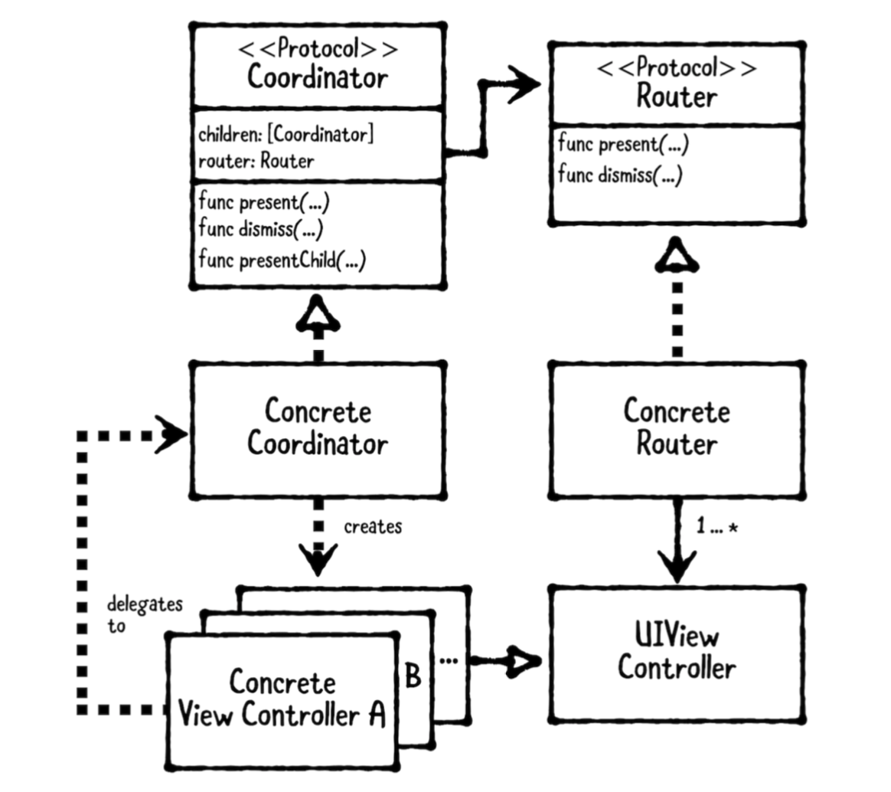

## Coordinator Pattern 

**출처 : [Raywenderlich](https://www.raywenderlich.com/158-coordinator-tutorial-for-ios-getting-started)**

### Resources

---

**Posts**

- [Coordinators](https://medium.com/@brunoroveas/coordinators-b29329582cdb)

- [Coordinators Essential tutorial. Part 1](https://medium.com/blacklane-engineering/coordinators-essential-tutorial-part-i-376c836e9ba7)
- [Coordinators Essential tutorial. Part 2](https://medium.com/blacklane-engineering/coordinators-essential-tutorial-part-ii-b5ab3eb4a74)

**Video**

- [Coordinators – Soroush Khanlou](https://youtu.be/a1g3k3NObkE)

- [How to use the Coordinator pattern in iOS](https://youtu.be/7HgbcTqxoN4)
- [Advanced Coordinators in iOS](https://youtu.be/ueByb0MBMQ4)

